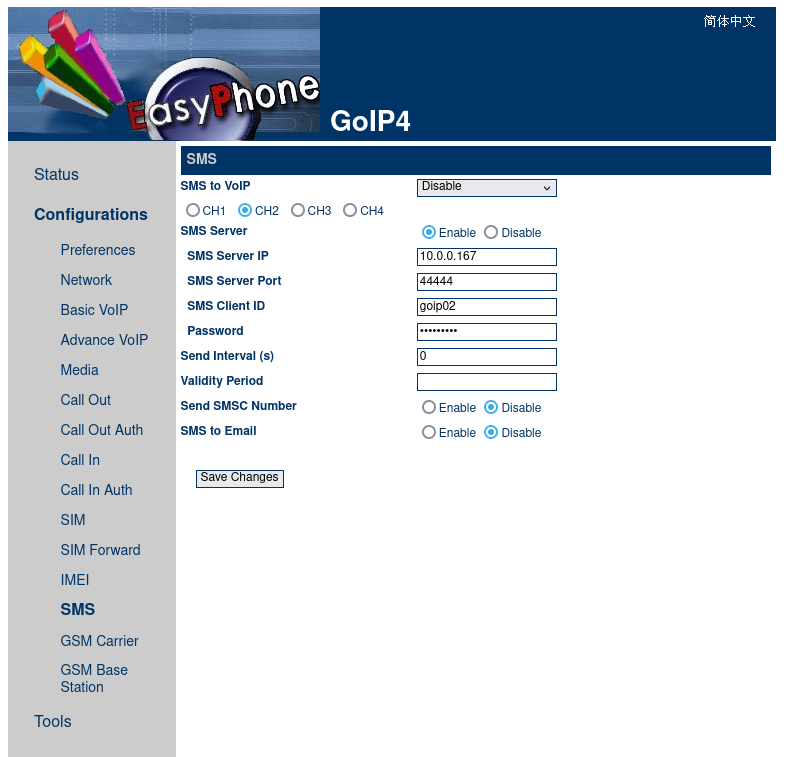

# GoIP SMS Receiver

This is a simple application for receiving SMS messages from a GoIP device. The messages are parsed and forwarded to an email address, but you can easily replace the email implementation with something else (database, MQTT etc.).

The counterpart application at https://github.com/iivorait/FSG-GOIP-snippet is for sending SMS messages using a simple restful API.

GoIP has an "SMS to Email" feature in Configurations --> SMS, but it does not work at least with my SMTP server.


## Execution - Building - Configuration

Requirements: a modern PHP version with the Sockets extension.
The email sending uses the PHPMailer library, which is installed with Composer (`composer install`).

Use with your existing server by executing `php receive.php` in a screen etc. session, or use the Dockerfile with Docker / Podman / Unraid / Portainer etc.. You can build the container image yourself, or use the builds from https://github.com/iivorait/GoIP-SMS-receiver/pkgs/container/goip-sms-receiver

```
podman build -t goipreceiver .
podman run -d --name goipreceiver -p 44444:44444/udp -e RECEIVE_PASSWORD=XXX -e SMTP_HOST=email.example.com -e SMTP_FROM=goip@example.com -e SMTP_TO=receiver@example.com goipreceiver
```

The configuration options are environment variables (execute e.g. `export RECEIVE_PORT=44443` if not using containers):

* RECEIVE_PORT = SMS Server Port in GoIP settings, "44444" by default
* RECEIVE_ID = SMS Client ID in GoIP settings, "goip01" by default
* RECEIVE_PASSWORD = Password in GoIP settings
* RECEIVE_LOG = log verbosity, "debug" for verbose logs by default, set to "prod" for less logs
* RECEIVE_WAIT = how long to wait for multipart SMS messages, by default "60", which is a safe option, but a bit slow
* SMTP_HOST = hostname/IP of the SMTP server
* SMTP_PORT = SMTP port, 25/465/587 etc., 25 by default
* SMTP_USERNAME = for logging into the SMTP server, optional if using an unauthenticated connection
* SMTP_PASSWORD = password to the SMTP server, optional
* SMTP_SECURE = encryption setting, optional. Possible values are empty, 'tls' and 'ssl'
* SMTP_FROM = the sender email address
* SMTP_TO = the recipient email address
* SMTP_PREFACE = text to be added in the beginning of the message body, optional

### GoIP configuration

Configure the SMS Server IP, SMS Server Port, SMS Client ID and Password in GoIP's Configurations --> SMS settings page:



 
## Technical details

GoIP sends the SMS messages via UDP to the defined SMS Server IP and SMS Server Port in the following format:

```
RECEIVE:$receiveId;id:$id;password:$password;srcnum:$srcnum;msg:$msg
```
for example: 
```
RECEIVE:1734804704;id:goip01;password:xxxxxx;srcnum:+358401234567;msg:Hello
```

See more details at https://github.com/iivorait/FSG-GOIP-snippet/blob/master/doc/goip_sms_Interface_en.pdf

If a long SMS message gets split into multiple parts, each of the parts is a separate message with a different $receiveId.
There is a logic implemented so that before sending the email, a specified time (by default 60 seconds) is waited and
messages with the same GoIP $id and $srcnum are gathered into the same email.


## Debugging email problems

### Error message: Helo command rejected: need fully-qualified hostname

Email server log:

```
postfix/submission/smtpd[129552]: NOQUEUE: reject: RCPT from 123-123-123-123a.fi[123.123.123.123]: 504 5.5.2 <ef23c2475c7a>: Helo command rejected: need fully-qualified hostname; from=<goip@example.com> to=<receiver@example.com> proto=ESMTP helo=<ef23c2475c7a>
```

The email server's name is expected to be in `helo=<ef23c2475c7a>`. That is the ID of the container. You can adjust the value with Docker run parameter `--hostname server.example.com`

### Error message: Relay access denied

Email server log:

```
postfix/submission/smtpd[133795]: NOQUEUE: reject: RCPT from 123-123-123-123a.fi[123.123.123.123]: 554 5.7.1 <receiver@example.com>: Relay access denied; from=<goip@example.com> to=<receiver@example.com> proto=ESMTP helo=<server.example.com>
```

Wrong authentication credentials

### Unable to use Microsoft/Outlook SMTP servers

As far as I know, since 16th of September 2024 you are not able to use any kind of password authentication (including App Passwords) with Outlook SMTP servers. See https://support.microsoft.com/en-gb/office/modern-authentication-methods-now-needed-to-continue-syncing-outlook-email-in-non-microsoft-email-apps-c5d65390-9676-4763-b41f-d7986499a90d